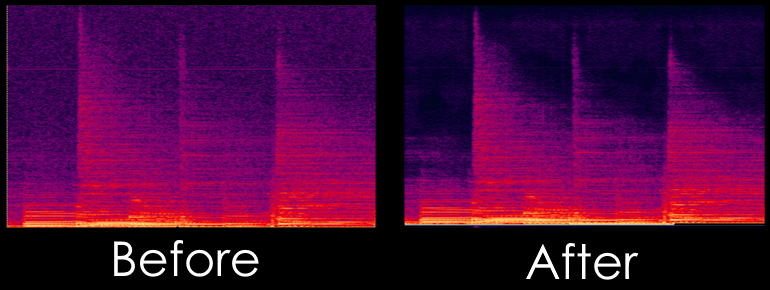

# DnCNN for Audio



This TF/Keras application implements an adaptation of the DnCNN machine learning model (https://arxiv.org/abs/1608.03981) (https://github.com/cszn/DnCNN)
to the task of denoising audio recordings, particularly old tape recordings where we can exploit the fact that the power spectrum of the noise being removed is constant and known.

It achieves its goal by transforming the audio stream into 256x256 images using DCT-4. Polarity (sign) is discarded (and added back in postprocessing) and logarithmic companding is employed to aid the training process.

This is a university project and not a finished product. It is clunky to use and can be improved significantly, but the basic idea is there.

# Usage

## Step 1: Preprocess the dataset
For best results, input audio files should be lossless and contain as little noise as possible.

```bash
python main.py --preprocess-input=[FOLDER WITH AUDIO FILES] --preprocess-output=[OUTPUT DATASET FOLDER]
```

## Step 2: Train the model
```bash
python main.py --train=[OUTPUT DATASET FOLDER]
```
Hyperparameters are currently not configurable from the command line.

## Step 3: Inference

Inference mode will always load `nrcnn.keras` from the working directory as the model.

```bash
python main.py --input=input.wav --output=output.wav
```

All audio formats supported by `libsndfile` are supported. Sample rates other than 44100 Hz may negatively impact denoising performance.

When run with the above snippet, -50dB RMS white noise will be assumed. This is rarely the case, so equalization will likely be necessary.

### Equalization

Invoke the program with additional arguments: 

```bash
python main.py --input=input.wav --output=output.wav --noise-print=noiseprint.wav --noise-floor=51.50
```

The file `noiseprint.wav` should ideally be a 5-10 second snippet of just the noise from the file you wish to denoise. The network will be trained to remove white noise at -50dB RMS, so the noise print file will be used to equalize and amplify the input audio to meet this requirement.

`--noise-floor=51.50` means that the input stream noise level is to be assumed to equal -51.5 dB RMS (AFTER equalization) and additional gain will be applied.

If you get a lot of "whispering" artifacts, try obtaining a cleaner noise print or adjust the `noise-floor` parameter (i.e. find a value between 47.0 and 53.0 that works best)

# The pretrained model

Head over to the Releases page to find a pretrained ~1M-parameter model. It has been trained on roughly 12 hours of digital lossless recordings of live concerts downloaded from archive.org. It has been trained over 15 hours on an RTX 3070, amounting to 20 epochs.

A before-and-after demo in the form of two short MP3 files is provided.

